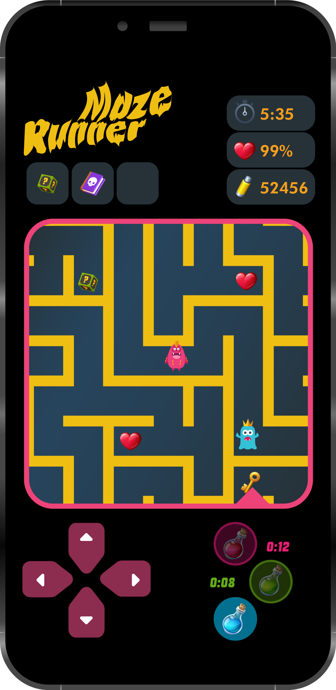

  

## Projektöversikt

MazeRunner är ett realtid multiplayer labyrintspel designat för universitets öppet hus-evenemang på Luleå Tekniska Universitet (LTU). Spelet tjänar som ett interaktivt demonstrationsverktyg som engagerar gymnasiestudenter samtidigt som det visar upp moderna webbutvecklingskapaciteter.

### Nyckelfunktioner
- **Realtid multiplayer**: Två spelare tävlar samtidigt
- **Plattformsoberoende**: Fungerar på smartphones, surfplattor och desktop-webbläsare
- **Åskådarläge**: Stor skärmdisplay för publikengagemang
- **Snabb installation**: Under 2 minuter från uppstart till spelbart tillstånd
- **Ingen installation**: Webbläsarbaserad, inga app-nedladdningar krävs

### Teknisk Stack

- **Frontend**: React med TypeScript
- **Backend**: C# med ASP.NET Core
- **Realtidskommunikation**: SignalR (WebSocket)
- **Databas**: SQLite för high scores
- **Distribution**: Enkel server på laptop

  

## Dokumentationsstruktur

### Kärndokumentation
- **[1. Introduktion](docs/introduction/README.md)** - Projektbakgrund och mål
- **[2. Kravspecifikation](docs/requirements/README.md)** - Systemkrav och användningsfall  
- **[3. Systemdesign](docs/design/README.md)** - Teknisk arkitektur och design
- **[4. Projektutförande](docs/execution/README.md)** - Projekthantering och tidslinje

### Stödjande Dokument
- **[Spelvision](GAME_CONCEPT.md)** - Komplett speldesignöversikt
- **[Expertintervju](STAKEHOLDER_QA.md)** - Intressent frågor och svar

## Licens

Detta projekt utvecklas som en del av en universitetskurs på Luleå Tekniska Universitet (LTU).

---

**Senast Uppdaterad**: Oktober 2025  
**Kurs**: Mjukvaruteknik  
**Institution**: Luleå Tekniska Universitet

## Laboratoriemål
Att demonstrera förståelse av mjukvarudesignprinciper genom att skapa ett välstrukturerat, dokumenterat och testat system.